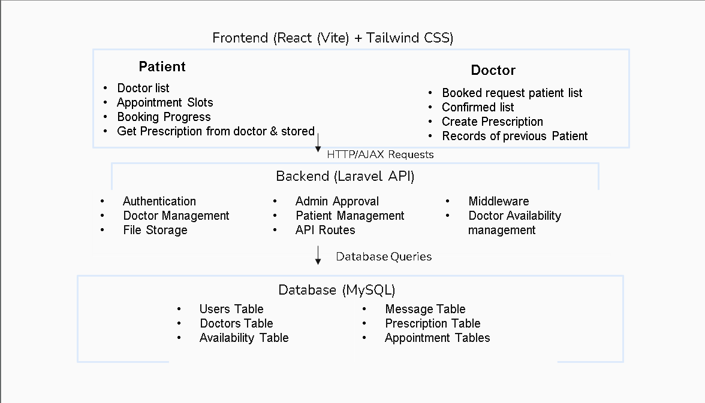

# BOOKMYDOC

*Team Members:*  


| ID           | Name                         | Email                             | 
|--------------|------------------------------|-----------------------------------|
| 20220204008  | Md. Asifuzzaman Shanto       | asifuzzaman2105@gmail.com         |
| 20220204021  | Md. Eousuf Abdullah Shameu   | eousuf.abdullah@gmail.com         |
| 20220204023  | Abdur Rafy Bhuiyan           | rafybhuiyan23@gmail.com           |


*Project Live Link:* [Insert URL]

---

## Table of Contents

1. [Project Description](#1-project-description)
2. [Workflow Overview](#2-workflow-overview)
3. [Main Features](#3-main-features)
4. [Technologies Used](#4-technologies-used)
5. [System Architecture](#5-system-architecture)
6. [Setup Guidelines](#6-setup-guidelines)
    - [Backend](#backend)
    - [Frontend](#frontend)
7. [Running the Application](#7-running-the-application)
8. [Deployment Status & Tests](#8-deployment-status--tests)
9. [Contribution Table](#9-contribution-table)
10. [Screenshots](#10-screenshots)
11. [Limitations ](#11-limitations)

---

## 1. Project Description

*BookMyDOC* is an advanced healthcare appointment system designed to bridge the gap between patients and doctors through a seamless, intuitive web interface. It simplifies the process of booking consultations, accessing prescriptions from doctors, and managing health records — all from one place.

BookMyDoc serves as a centralized medical platform for both patients and doctors. The project allows patients to search for nearby doctors, make appointments based on availability and receive AI-based recommendations. Doctors can view upcoming appointments, maintain medical histories, generate digital prescriptions, and manage their schedules.

---

## 2. Workflow Overview

High-level workflow of your project (can include a diagram).

1. Patients sign up / log in.  
2. They search for doctors by specialty, location, or availability.
3. Patients book, cancel, or reschedule appointments.  
4. Doctors manage their schedules, view patient history, and generate prescriptions.  
5. Patients and doctors can access medical records securely at any time.  

---

## 3. Main Features

- Role-based dashboards for both doctors and patients  
- Appointment booking, cancellation, and rescheduling  
- Prescription management with PDF export 
- Contact & support with categorized feedback  
- Clean and responsive UI design (optimized for healthcare use)  


---

## 4. Technologies Used

- **Frontend:** React (Vite), Tailwind CSS  
- **Backend:** Laravel (PHP)  
- **Database:** MySQL  
- **APIs:** RESTful APIs  
- **Other Tools:** GitHub,Docker, WakaTime  

---

## 5. System Architecture



---

## 6. Setup Guidelines

### Backend

# Clone the repository

```bash
   git clone https://github.com/RafyBhuiyan/BookMyDoc.git
   cd .\BookMyDoc\
   cd backend
```

# Install dependencies

```bash
   npm install

# Setup environment variables
cp .env.example .env
# Edit .env as needed

# Run backend server
npm start

### Frontend

cd frontend

# Install dependencies
npm install

# Setup environment variables
cp .env.example .env
# Edit .env as needed

# Run frontend
npm start
```
---

## 7. Running the Application

Steps to run the app locally, or access the live deployed version.

## 8. Deployment Status & Tests

| Component | Is Deployed? | Is Dockerized? | Unit Tests Added? (Optional) | Is AI feature implemented? (Optional) |
|-----------|--------------|----------------|-------------------|--------------------------|
| Backend   |    Yes       |         Yes    |  No              | No                     |
| Frontend  |    Yes       |         Yes    |  Yes               | No                      |


## 9. Contribution Table

| Metric                         | Total | Backend | Frontend | Md. Asifuzzaman Shanto | Md. Eousuf Abdullah Shameu | Abdur Rafy Bhuiyan |
|--------------------------------|-------|---------|----------|-------------------------|-----------------------------|---------------------|
| Issues Solved                  | 16    |         |          | 6                       | 6                           | 7                   |
| WakaTime Contribution (Hours)  |       |         |          | [](https://wakatime.com/badge/user/8e47db68-1502-4309-b657-785629e3abc9/project/06b70473-2e2d-4818-8199-c7f72e45fada) | [](https://wakatime.com/badge/user/ebb7cd30-f68a-4bca-bbaa-64776c6f5843/project/7b3829bf-8896-4254-aab4-3af2584c9134) | [](https://wakatime.com/badge/user/8e47db68-1502-4309-b657-785629e3abc9/project/06b70473-2e2d-4818-8199-c7f72e45fada) |
|

## 10. Screenshots


## 11. Limitations 

- No real-time chat between patients and doctors (future scope)  
- Medical reports have not been prepared properly  
- Payment system not integrated  

---